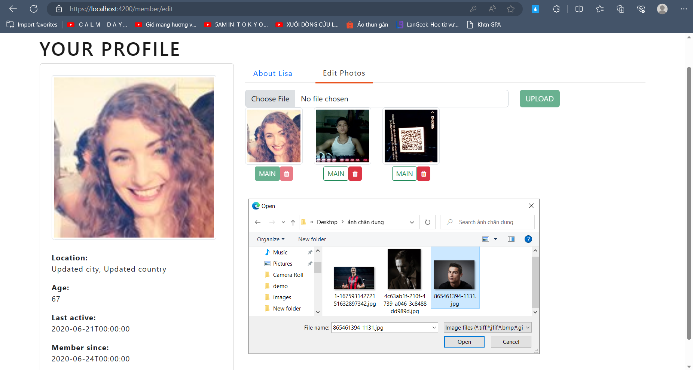

# Demo (In progress)

## *Completed function:* 

* Authentication
* Login
* Register
* Show list of members
* View member info
* Edit information
* Upload images integrated into a cloud platform (Cloundinary)

### 1. Login

### 2. Register

Custom text input form and custom validators for registration

### 3. List members

### 4. View member information

### 4. Edit Info

### 5. Upload photo

